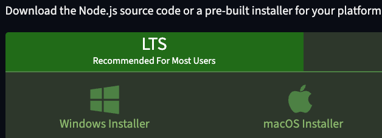
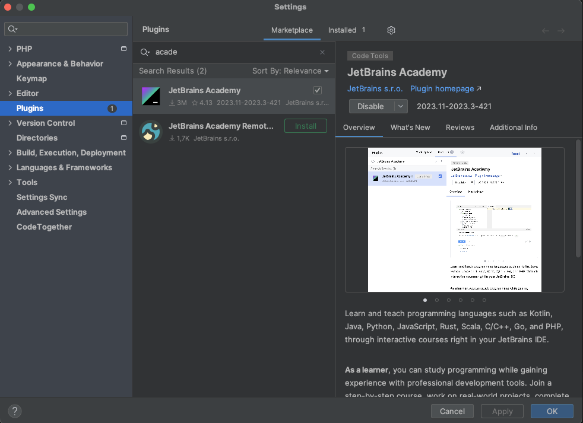
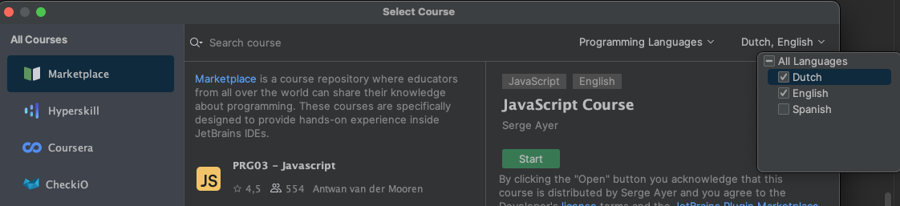
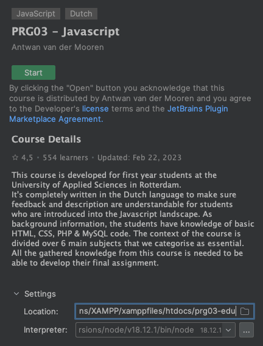
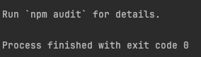
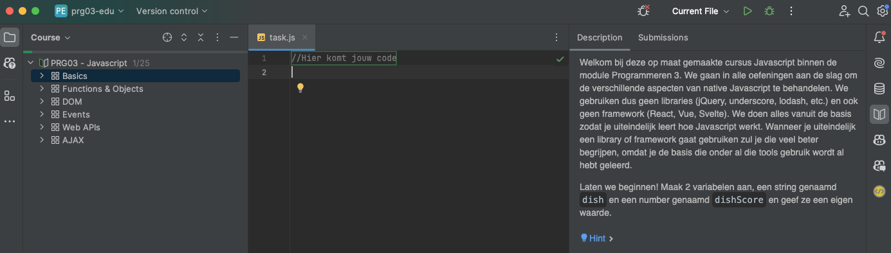
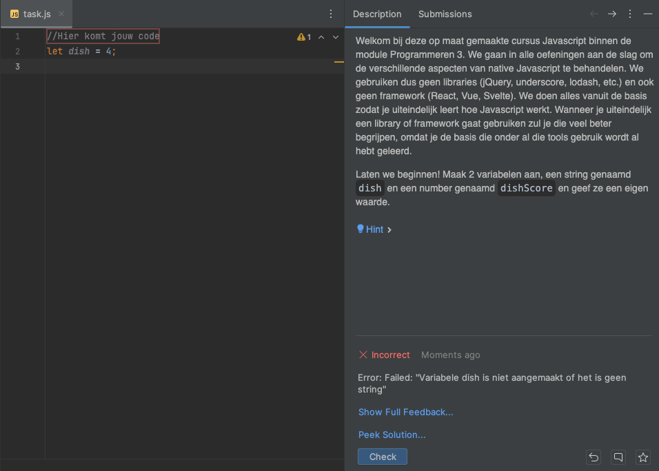
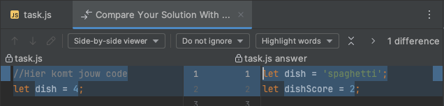
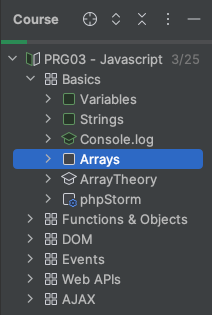

# EDU-course

Tijdens deze module bereid je jezelf per les voor door middel van de
EDU-course. Dit is een middel om alle Javascript theorie uit dit kwartaal
tot je te nemen en gemakkelijk te kunnen herhalen als je iets nog niet
helemaal snapt.

> Let op: Meedoen aan deze EDU-course is verplicht. Deze opdrachten zijn
> voorwaardelijk om mee te mogen doen aan de praktijkopdracht. Lees de
> eisen hiervoor goed na in hoofdstuk 3.2 van de cursushandleiding.

## Installatie

Om aan de slag te kunnen moet je aan aantal stappen doorlopen.

### NodeJS

Als eerste moet je NodeJS installeren. Ga hiervoor naar de
[download](https://nodejs.org/en/download) pagina en kies hier de LTS-versie
voor je eigen besturingssysteem.

|  | 
|:-------------------------------------------:| 
|              *NodeJS Download*              |

Als tijdens de installatie gevraagd wordt of het aan het `$PATH` toegevoegd
moet worden antwoord je daarop "ja".

### Installatie plugin

Om de EDU-course te kunnen starten heb je de "JetBrains Academy" plugin nodig.
Deze kun je installeren door in phpStorm naar je `Settings -> Plugins` te
gaan en daar te zoeken op "JetBrains Academy" in de Marketplace. Na installatie
moet je phpStorm opnieuw opstarten.

|  | 
|:------------------------------------------------------------:| 
|                  *JetBrains Academy plugin*                  |

Na herstart kun je via `File -> Learn & Teach -> Browse courses` zorgen dat je
de course kunt gaan zoeken. Binnen dat venster kies je rechtsbovenin voor de
"Dutch language" zodat de course tevoorschijn komt.

|  | 
|:-----------------------------------------------------:| 
|            *De Nederlandse taal aanzetten*            |

Kies daarna PRG03 - Javascript en pas onder settings het pad aan waar het project
wordt neergezet. Dit moet namelijk binnen je htdocs van XAMPP geplaatst worden!

|  | 
|:-------------------------------------:| 
|    *Let op je pad binnen htdocs!*     |

Druk nu op "Start". Daarmee wordt het nieuwe project geopend en volgt een scherm
waarin je een hoop commando's voorbij ziet komen omdat de course voor je
geïnstalleerd wordt. Wanneer je onderstaande ziet, is hij klaar en kun je dat
venster sluiten.

|  | 
|:-----------------------------------------:| 
|   *Wacht tot installatie 'finished' is*   |

## Starten met course

De installatie is gelukt en je kunt komende lessen dus voorbereid inkomen door
de gevraagde onderdelen uit te voeren.

> Bekijk op Brightspace dus goed wanneer je jouw bewijs per onderdeel moet
> inleveren. Als je dit vergeet loop je het risico niet mee te kunnen doen
> aan de praktijkopdracht.

In de structuur zie je links de opdrachten, in het midden de code die je gaat
schrijven en rechts de uitleg wat je moet doen voor de betreffende opdracht.

|  | 
|:---------------------------------------------:| 
|            *Overzicht van course*             |

Als je een opdracht controleert op het antwoord via de 'Check' knop, krijg je
feedback als de vraag niet goed is gegaan. Je kunt het zo vaak proberen als je
wilt. Mocht je uiteindelijk niet uit een opdracht komen, dan kun je de "Peek
Solution" knop gebruiken. Daarmee kun je jouw eigen antwoord vergelijken met het
goede antwoord.

|  | 
|:-------------------------------------------:| 
|      *Feedback na beantwoorden vraag*       |

|     | 
|:-------------------------------------------------:| 
| *Peek Solution kun je gebruiken als je vastloopt* |

Als je het antwoord uiteindelijk, met of zonder hulp, goed hebt gedaan zie je jouw
voortgang doordat opdrachten groen worden. Als je voortgang inlevert op de gevraagde
data, dan lever je dus een screenshot in van je eigen werk waarin de betreffende
opdrachten groen zijn.

|  | 
|:--------------------------------------------:| 
|    *Zichtbare voortgang binnen de course*    |

> Ben niet bang om fouten te maken. Het hele doel van deze opdrachten is dat je
> voorbereid bent op de les, maar ook dat je in je eigen tijd nog kunt oefenen als
> je bepaalde concepten nog moeilijk vindt. Vooral veel plezier gewenst!
