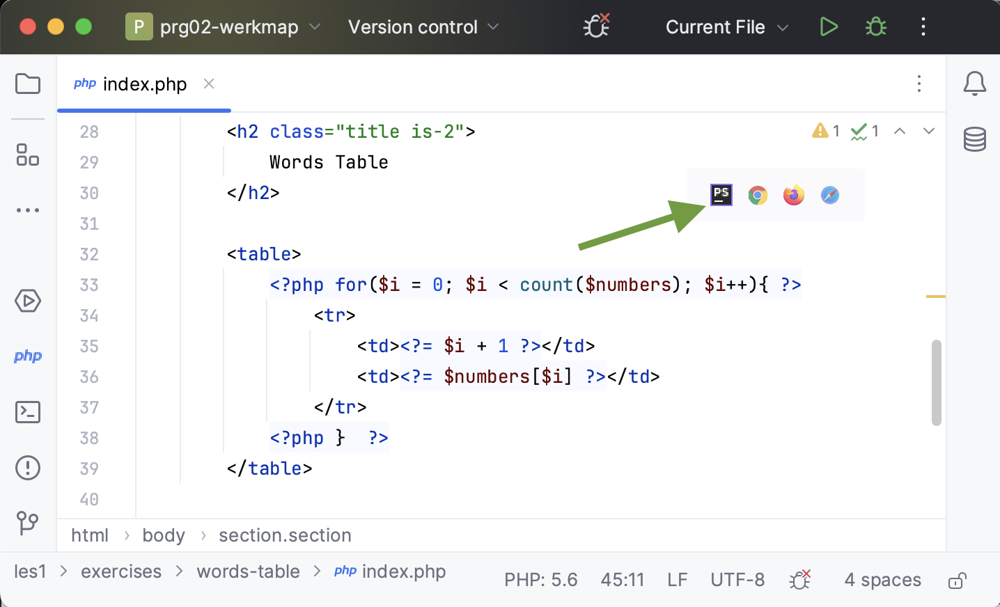
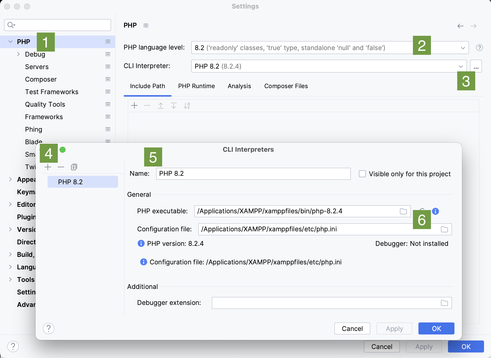
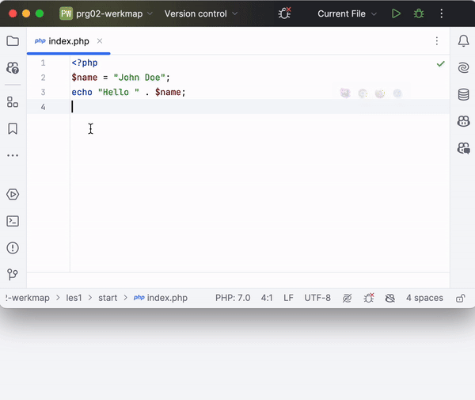
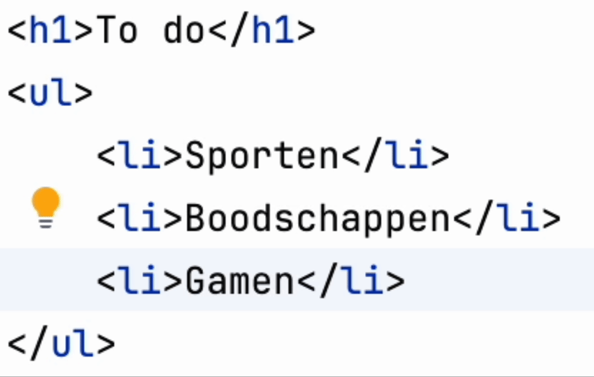
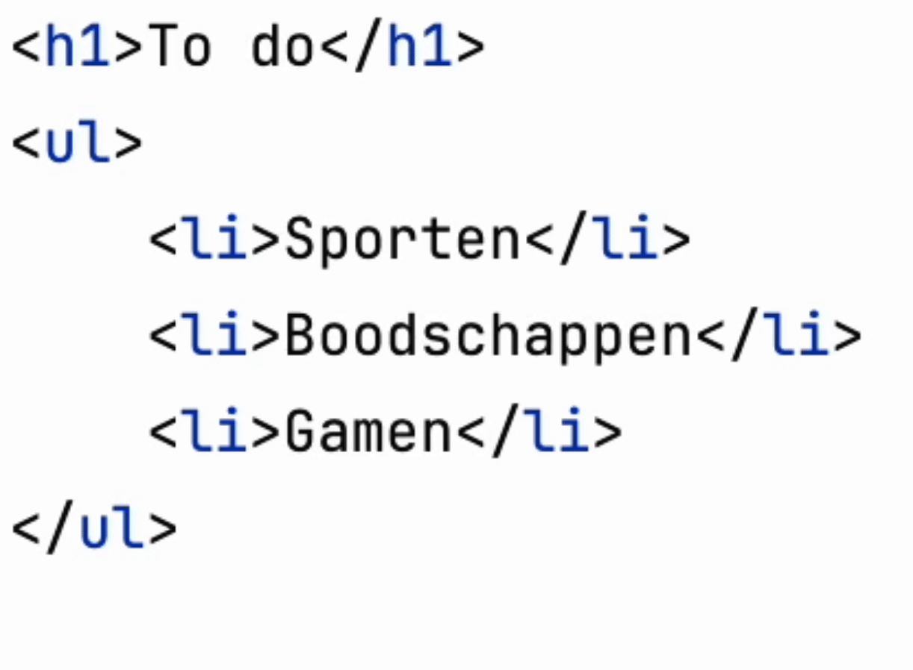
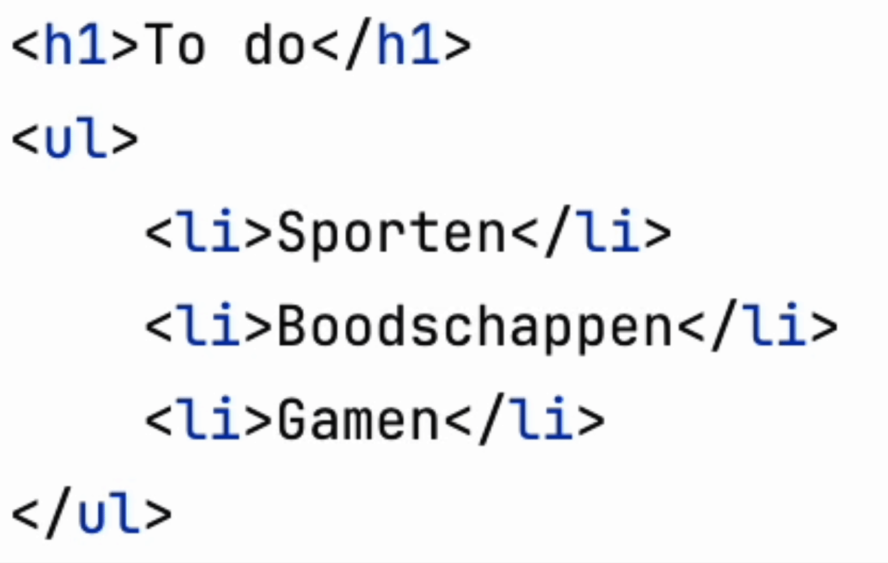
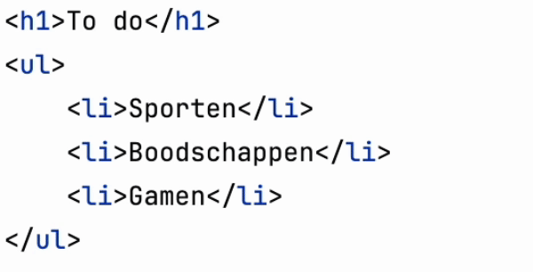

# Pro tips PhpStorm

 

**Inhoudsopgave**

- [Pro tips PhpStorm](#pro-tips-phpstorm)
- [Inleiding](#inleiding)
- [Preview](#preview)
- [Variabele refactoren](#variabele-refactoren)
- [Shortcuts](#shortcuts)
  - [Regel omhoog/omlaag](#regel-omhoogomlaag)
  - [Regel dupliceren](#regel-dupliceren)
  - [Regel verwijderen](#regel-verwijderen)
  - [Meerdere regels tegelijkertijd bewerken](#meerdere-regels-tegelijkertijd-bewerken)
- [Git repository downloaden](git.md)

 
 

# Inleiding

Op deze pagina vind je een aantal pro tips voor het gebruik van PhpStorm.

# Preview

Rechts bovenin je code zie je het icoontje van PhpStorm staan en van drie browsers. Wanneer je op één van deze icoontjes
klikt opent zich een preview-weergave van jouw code die automatisch ververst wanneer je de code aanpast. Handig, alleen
moet je hiervoor wel eerst iets instellen.

Open de instellingen van PhpStorm en doorloop de volgende stappen. De cijfers corresponderen met de stappen die onder de
screenshot staan.

1. Klik links op `PHP`
2. Kies in de dropdown `PHP 8.2`
3. Klik op de drie puntjes, zodat de popup zich opent
4. Klik op het plusje
5. Voer de naam `PHP 8.2` in
6. Voer het juiste pad in naar `php` en de `php.ini`. In bovenstaand screenshot staat het pad op een Mac, maar voor
   Windows is hij hetzelfde vanaf `XAMPP/`.

Sla dit nu op en je zou de preview-knopjes moeten kunnen gebruiken.

 

# Variabele refactoren

Heb je een variabele al op meerdere plekken in de code gebruikt en wil je hem hernoemen? Dan kan je deze zogenaamd refactoren. Doorloop de volgende stappen:
 

1. Klik met de rechtermuistoets op de variabele en vervolgens `Refactoren -> Rename...` (shortcut: `⇧ Shift` `F6`)
2. Voer de nieuwe naam van de variabele in
3. Kies de scope van de refactoring; moet het door het hele project veranderd worden, of bijvoorbeeld alleen in het huidige bestand?
4. Klik op `Refactor`

 

# Shortcuts

Hieronder vind je een aantal veelgebruikte shortcuts die het werken met PhpStorm makkelijker maken. Hier worden de
shortcuts getoond zoals ze standaard door PhpStorm staan ingesteld, maar je kan de shortcuts
ook [naar wens aanpassen](https://www.jetbrains.com/help/phpstorm/configuring-keyboard-and-mouse-shortcuts.html).
 
Verder vind je onder de volgende link een uitgebreider overzicht van shortcuts voor zowel Windows als
Mac: [PhpStorm Referencecard](https://resources.jetbrains.com/storage/products/phpstorm/docs/PhpStorm_ReferenceCard.pdf).

**Legenda symbolen Mac**

| Symbool | Omschrijving |
|---------|--------------|
| ⌘       | Command      |
| ⌥       | Option       |
| ⇧       | Shift        |

## Regel omhoog/omlaag

| OS      | Shortcut              |
|---------|-----------------------|
| Windows | Alt + Shift + Up/Down |
| Mac     | ⌥⇧ Up/Down            |

## Regel dupliceren

| OS      | Shortcut |
|---------|----------|
| Windows | Ctrl + D |
| Mac     | ⌘D       |

## Regel verwijderen

| OS      | Shortcut |
|---------|----------|
| Windows | Ctrl + Y |
| Mac     | ⌘⌫       |

## Meerdere regels tegelijkertijd bewerken

**Per regel**

| OS      | Shortcut       |
|---------|----------------|
| Windows | Alt + muisklik |
| Mac     | ⌥ muisklik     |

**Meerdere regels onder elkaar**

| OS      | Shortcut                                                     |
|---------|--------------------------------------------------------------|
| Windows | Alt + Shift + muisklik + naar beneden/boven gaan met je muis |
| Mac     | ⌥⇧ muisklik + naar beneden/boven gaan met je muis            |

