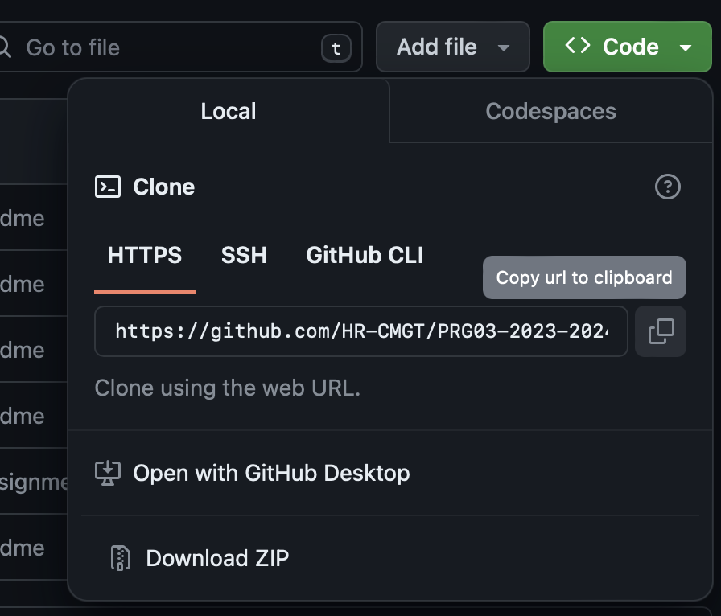
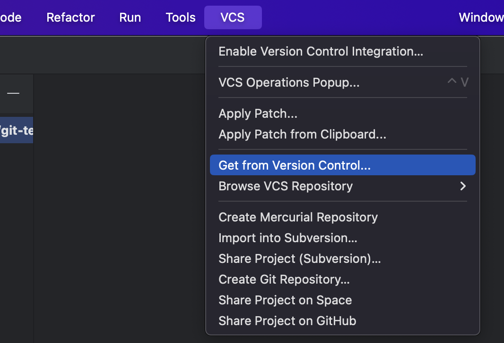
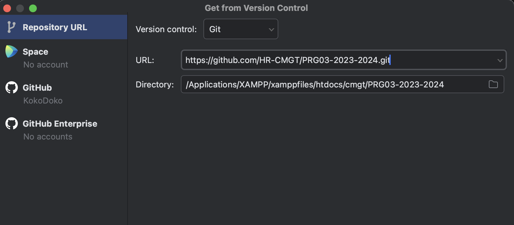

# Github repository downloaden met PHPStorm

1. Kopieer de `.git` url uit de github pagina.

2. Maak een nieuwe lege projectmap in PHPStorm.
3. Kies *VCS* en *Get from Version Control*.

4. Plak de url. Kies optie *Git*, en klik op *Clone*.

5. Nu kan je elke les de update downloaden via *Git*, en klik op *Pull*.

